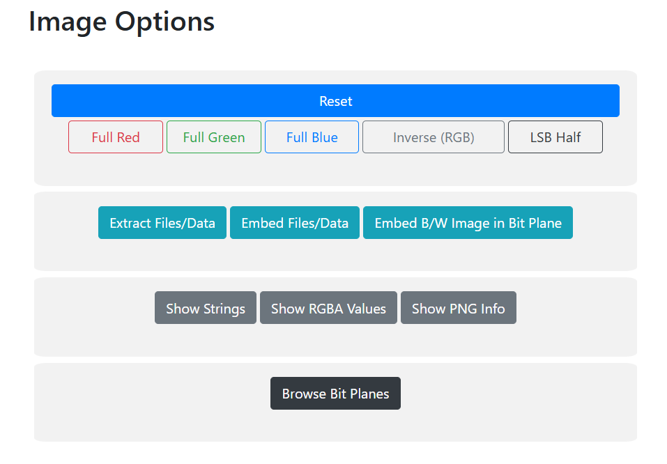
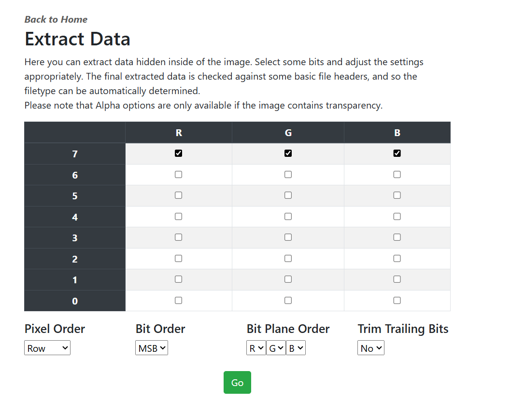
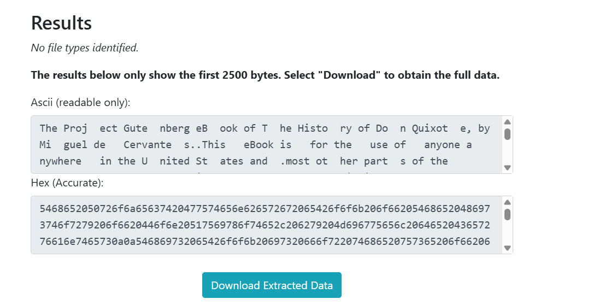

# 1. Clue Gathering

Problem named 'MSB' and the image is heavily altered ([origin](https://ukiyo-e.org/image/jaodb/Kunisada_1_Utagawa-Ukiyo_e_Comparison_of_Genji-CH12-00030048-070125-F12)). 

# 2. Analysis using zsteg

```bash
zsteg Ninja-and-Prince-Genji-Ukiyoe-Utagawa-Kunisada.flag.png
```

Output:
```bash
└─$ zsteg Ninja-and-Prince-Genji-Ukiyoe-Utagawa-Kunisada.flag.png
imagedata           .. text: "~~~|||}}}"
b1,g,lsb,xy         .. file: Common Data Format (Version 2.5 or earlier) data
b1,g,msb,xy         .. file: Common Data Format (Version 2.5 or earlier) data
b2,r,lsb,xy         .. text: ["U" repeated 8 times]
b2,g,lsb,xy         .. file: Matlab v4 mat-file (little endian) \252\252\252\252\252\252\252\252, numeric, rows 4294967295, columns 4294967295
b2,g,msb,xy         .. file: Matlab v4 mat-file (little endian) UUUUUUUU, numeric, rows 4294967295, columns 4294967295
b2,b,lsb,xy         .. text: ["U" repeated 8 times]
b4,r,lsb,xy         .. text: ["w" repeated 8 times]
b4,r,msb,xy         .. text: ["U" repeated 12 times]
b4,g,msb,xy         .. text: ["w" repeated 16 times]
b4,b,lsb,xy         .. text: "\"\"\"\"\"\"\"\"4DC\""
b4,b,msb,xy         .. text: "wwwwwwww3333"
```

# 3. Extract an embedded file using online tools `StegOnline`

https://georgeom.net/StegOnline/extract



After uploading select extract files/data



Since its MSB problem-set, select bit 7 for Red Green Blue. 7 is the most significant bit.



Download extracted file, flag is within the extracted file.