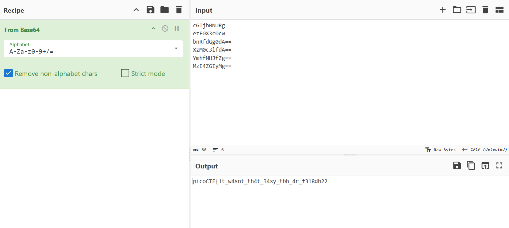

# 1. Sort packet by timestamp

```bash
reordercap input.pcap input_sorted.pcap
tshark -r ts-sorted.pcap -x
```

```bash
└─$ tshark -r ts-sorted.pcap -x
0000  45 00 00 30 00 01 00 00 40 06 f8 72 c0 a8 00 02   E..0....@..r....
0010  c0 a8 01 02 00 14 00 50 00 00 00 00 00 00 00 00   .......P........
0020  50 02 20 00 be f4 00 00 2f 35 66 71 51 49 67 3d   P. ...../5fqQIg=

0000  45 00 00 30 00 01 00 00 40 06 f8 72 c0 a8 00 02   E..0....@..r....
0010  c0 a8 01 02 00 14 00 50 00 00 00 00 00 00 00 00   .......P........
0020  50 02 20 00 79 27 00 00 66 54 64 31 56 37 73 3d   P. .y'..fTd1V7s=

0000  45 00 00 30 00 01 00 00 40 06 f8 72 c0 a8 00 02   E..0....@..r....
0010  c0 a8 01 02 00 14 00 50 00 00 00 00 00 00 00 00   .......P........
0020  50 02 20 00 ff 08 00 00 31 36 48 41 47 64 4d 3d   P. .....16HAGdM=

0000  45 00 00 30 00 01 00 00 40 06 f8 72 c0 a8 00 02   E..0....@..r....
0010  c0 a8 01 02 00 14 00 50 00 00 00 00 00 00 00 00   .......P........
0020  50 02 20 00 b8 dd 00 00 50 54 79 65 56 4d 34 3d   P. .....PTyeVM4=

0000  45 00 00 30 00 01 00 00 40 06 f8 72 c0 a8 00 02   E..0....@..r....
0010  c0 a8 01 02 00 14 00 50 00 00 00 00 00 00 00 00   .......P........
0020  50 02 20 00 69 ff 00 00 62 44 6d 4f 68 51 6b 3d   P. .i...bDmOhQk=

0000  45 00 00 30 00 01 00 00 40 06 f8 72 c0 a8 00 02   E..0....@..r....
0010  c0 a8 01 02 00 14 00 50 00 00 00 00 00 00 00 00   .......P........
0020  50 02 20 00 79 b2 00 00 68 58 7a 6c 78 6d 38 3d   P. .y...hXzlxm8=

0000  45 00 00 30 00 01 00 00 40 06 f8 72 c0 a8 00 02   E..0....@..r....
0010  c0 a8 01 02 00 14 00 50 00 00 00 00 00 00 00 00   .......P........
0020  50 02 20 00 a8 d9 00 00 2f 42 62 61 67 67 6b 3d   P. ...../Bbaggk=

0000  45 00 00 30 00 01 00 00 40 06 f8 72 c0 a8 00 02   E..0....@..r....
0010  c0 a8 01 02 00 14 00 50 00 00 00 00 00 00 00 00   .......P........
0020  50 02 20 00 92 ec 00 00 52 5a 4f 44 61 59 77 3d   P. .....RZODaYw=

0000  45 00 00 30 00 01 00 00 40 06 f8 72 c0 a8 00 02   E..0....@..r....
0010  c0 a8 01 02 00 14 00 50 00 00 00 00 00 00 00 00   .......P........
0020  50 02 20 00 aa fc 00 00 47 49 64 48 43 56 73 3d   P. .....GIdHCVs=

0000  45 00 00 30 00 01 00 00 40 06 f8 72 c0 a8 00 02   E..0....@..r....
0010  c0 a8 01 02 00 14 00 50 00 00 00 00 00 00 00 00   .......P........
0020  50 02 20 00 c9 cc 00 00 4c 68 76 66 37 49 49 3d   P. .....Lhvf7II=

0000  45 00 00 30 00 01 00 00 40 06 f8 72 c0 a8 00 02   E..0....@..r....
0010  c0 a8 01 02 00 14 00 50 00 00 00 00 00 00 00 00   .......P........
0020  50 02 20 00 b2 18 00 00 46 47 6e 30 43 54 63 3d   P. .....FGn0CTc=

0000  45 00 00 30 00 01 00 00 40 06 f8 72 c0 a8 00 02   E..0....@..r....
0010  c0 a8 01 02 00 14 00 50 00 00 00 00 00 00 00 00   .......P........
0020  50 02 20 00 ce 06 00 00 39 4b 57 4c 7a 46 34 3d   P. .....9KWLzF4=

0000  45 00 00 30 00 01 00 00 40 06 f8 72 c0 a8 00 02   E..0....@..r....
0010  c0 a8 01 02 00 14 00 50 00 00 00 00 00 00 00 00   .......P........
0020  50 02 20 00 cb d4 00 00 2f 45 4c 70 78 5a 4d 3d   P. ...../ELpxZM=

0000  45 00 00 30 00 01 00 00 40 06 f8 72 c0 a8 00 02   E..0....@..r....
0010  c0 a8 01 02 00 14 00 50 00 00 00 00 00 00 00 00   .......P........
0020  50 02 20 00 c7 fc 00 00 50 4b 48 54 53 48 59 3d   P. .....PKHTSHY=

0000  45 00 00 30 00 01 00 00 40 06 f8 72 c0 a8 00 02   E..0....@..r....
0010  c0 a8 01 02 00 14 00 50 00 00 00 00 00 00 00 00   .......P........
0020  50 02 20 00 c9 10 00 00 66 35 34 38 58 66 51 3d   P. .....f548XfQ=

Frame (52 bytes):
0000  45 00 00 34 00 01 00 00 40 06 f8 6e c0 a8 00 02   E..4....@..n....
0010  c0 a8 01 02 00 14 00 50 00 00 00 00 00 00 00 00   .......P........
0020  50 02 20 00 fd 41 00 00 63 47 6c 6a 62 30 4e 55   P. ..A..cGljb0NU
0030  52 67 3d 3d                                       Rg==
Reassembled TCP (12 bytes):
0000  2f 35 66 71 51 49 67 3d 52 67 3d 3d               /5fqQIg=Rg==

0000  45 00 00 34 00 01 00 00 40 06 f8 6e c0 a8 00 02   E..4....@..n....
0010  c0 a8 01 02 00 14 00 50 00 00 00 00 00 00 00 00   .......P........
0020  50 02 20 00 05 5b 00 00 65 7a 46 30 58 33 63 30   P. ..[..ezF0X3c0
0030  63 77 3d 3d                                       cw==

0000  45 00 00 34 00 01 00 00 40 06 f8 6e c0 a8 00 02   E..4....@..n....
0010  c0 a8 01 02 00 14 00 50 00 00 00 00 00 00 00 00   .......P........
0020  50 02 20 00 eb 52 00 00 62 6e 52 66 64 47 67 30   P. ..R..bnRfdGg0
0030  64 41 3d 3d                                       dA==

0000  45 00 00 34 00 01 00 00 40 06 f8 6e c0 a8 00 02   E..4....@..n....
0010  c0 a8 01 02 00 14 00 50 00 00 00 00 00 00 00 00   .......P........
0020  50 02 20 00 f6 5a 00 00 58 7a 4d 30 63 33 6c 66   P. ..Z..XzM0c3lf
0030  64 41 3d 3d                                       dA==

0000  45 00 00 34 00 01 00 00 40 06 f8 6e c0 a8 00 02   E..4....@..n....
0010  c0 a8 01 02 00 14 00 50 00 00 00 00 00 00 00 00   .......P........
0020  50 02 20 00 1a f7 00 00 59 6d 68 66 4e 48 4a 66   P. .....YmhfNHJf
0030  5a 67 3d 3d                                       Zg==

0000  45 00 00 34 00 01 00 00 40 06 f8 6e c0 a8 00 02   E..4....@..n....
0010  c0 a8 01 02 00 14 00 50 00 00 00 00 00 00 00 00   .......P........
0020  50 02 20 00 4c 0a 00 00 4d 7a 45 34 5a 47 49 79   P. .L...MzE4ZGIy
0030  4d 67 3d 3d                                       Mg==

0000  45 00 00 2c 00 01 00 00 40 06 f8 76 c0 a8 00 02   E..,....@..v....
0010  c0 a8 01 02 00 14 00 50 00 00 00 00 00 00 00 00   .......P........
0020  50 02 20 00 69 97 00 00 66 51 3d 3d               P. .i...fQ==
```
# 2. Hexdump and decode base64

After trial and error, packet 1-15 (from ts-ordered.pcap) is gibberish if its decoded from base64 but packet 16-21 however:

```bash
tshark -r file.pcap -Y "frame.number >= 16 acnd frame.number <= 21" -x

# -Y "frame.number >= 17 and frame.number <= 21" filters in packet 16-21
# -x shows hex dump of packet
```

```bash
└─$ tshark -r ts-sorted.pcap -Y "frame.number >= 16 and frame.number <= 21" -x
Frame (52 bytes):
0000  45 00 00 34 00 01 00 00 40 06 f8 6e c0 a8 00 02   E..4....@..n....
0010  c0 a8 01 02 00 14 00 50 00 00 00 00 00 00 00 00   .......P........
0020  50 02 20 00 fd 41 00 00 63 47 6c 6a 62 30 4e 55   P. ..A..cGljb0NU
0030  52 67 3d 3d                                       Rg==
Reassembled TCP (12 bytes):
0000  2f 35 66 71 51 49 67 3d 52 67 3d 3d               /5fqQIg=Rg==

0000  45 00 00 34 00 01 00 00 40 06 f8 6e c0 a8 00 02   E..4....@..n....
0010  c0 a8 01 02 00 14 00 50 00 00 00 00 00 00 00 00   .......P........
0020  50 02 20 00 05 5b 00 00 65 7a 46 30 58 33 63 30   P. ..[..ezF0X3c0
0030  63 77 3d 3d                                       cw==

0000  45 00 00 34 00 01 00 00 40 06 f8 6e c0 a8 00 02   E..4....@..n....
0010  c0 a8 01 02 00 14 00 50 00 00 00 00 00 00 00 00   .......P........
0020  50 02 20 00 eb 52 00 00 62 6e 52 66 64 47 67 30   P. ..R..bnRfdGg0
0030  64 41 3d 3d                                       dA==

0000  45 00 00 34 00 01 00 00 40 06 f8 6e c0 a8 00 02   E..4....@..n....
0010  c0 a8 01 02 00 14 00 50 00 00 00 00 00 00 00 00   .......P........
0020  50 02 20 00 f6 5a 00 00 58 7a 4d 30 63 33 6c 66   P. ..Z..XzM0c3lf
0030  64 41 3d 3d                                       dA==

0000  45 00 00 34 00 01 00 00 40 06 f8 6e c0 a8 00 02   E..4....@..n....
0010  c0 a8 01 02 00 14 00 50 00 00 00 00 00 00 00 00   .......P........
0020  50 02 20 00 1a f7 00 00 59 6d 68 66 4e 48 4a 66   P. .....YmhfNHJf
0030  5a 67 3d 3d                                       Zg==

0000  45 00 00 34 00 01 00 00 40 06 f8 6e c0 a8 00 02   E..4....@..n....
0010  c0 a8 01 02 00 14 00 50 00 00 00 00 00 00 00 00   .......P........
0020  50 02 20 00 4c 0a 00 00 4d 7a 45 34 5a 47 49 79   P. .L...MzE4ZGIy
0030  4d 67 3d 3d                                       Mg==
```

